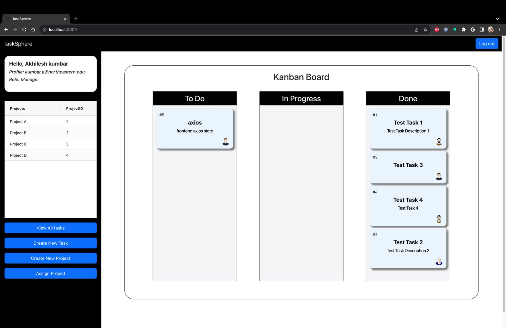
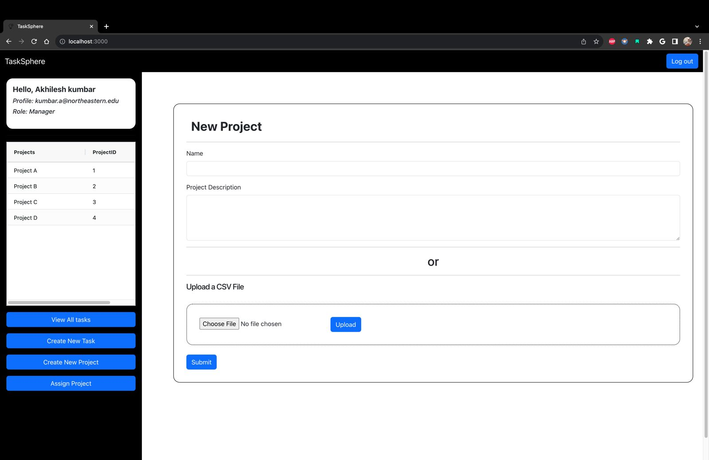

# TaskSphere - Collaborative Task Management System

TaskSphere is a **collaborative project and task management system** inspired by Kanban principles. Designed as part of the **CSYE 6200 Object-Oriented Design coursework**, this project was originally hosted on a private university GitHub profile. TaskSphere provides a **visual project board**, allowing users to efficiently create, assign, and track tasks. It features real-time task updates, user authentication via **JWT tokens**, and supports **import/export functionalities** for streamlined project management. 

## 🚀 Features

### 🔹 User Features
- **User Authentication:** Secure login and registration with **JWT tokens**.
- **Profile Management:** View and update user details.
- **Task Management:** Create, update, delete, assign, prioritize, and track tasks.
- **Project Collaboration:** Create, assign, and manage projects, with user-role-based access.
- **CSV Import/Export:** Projects can be imported and exported via CSV.

### 🔹 Admin Features
- Manage **users, projects, and tasks**.

### 🔹 Security
- **JWT-based authentication** for secure access.
- **Role-based access control** (Admin, Manager, Developer).

---

## 🛠️ Tech Stack

### **Backend**
- **Java & Spring Boot**: REST API implementation
- **PostgreSQL**: Relational database
- **Spring Security**: Authentication & authorization
- **JPA & Hibernate**: ORM for database interactions

### **Frontend**
- **React.js**: Frontend framework
- **HTML, CSS, JS**: UI development

---

## How the application looks - 





---

## 📌 System Architecture & Flows

TaskSphere follows the **MVC (Model-View-Controller)** pattern:
- **Model:** Database entities managed via Hibernate.
- **View:** React components rendering UI.
- **Controller:** API endpoints processing requests.

### **Key Flows**
#### **User Flow**
- Users register/login through `AuthenticationController`.
- User information is stored securely.

#### **Authentication Flow**
- JWT token generation upon successful authentication.
- Tokens are used to authorize API requests.

#### **Project Flow**
- `ProjectController` manages CRUD operations for projects.
- Users can be assigned projects, and data can be exported/imported.

#### **Task Flow**
- `TaskController` handles CRUD operations for tasks.
- Users can change task **priority**, **status**, and **assignee**.

---

## 🔑 Core OOP Concepts & Design Patterns Used

### **OOP Principles**
- **Inheritance:** `ProjectRequest` extends `ProjectDTO`.
- **Polymorphism:** Methods like `toString`, `equals`, and `compareTo` override base implementations.
- **Abstraction:** `ProjectDTO` defines abstract methods for project creation.

### **Design Patterns**
- **Repository Pattern:** Provides a structured way to access data (`UserRepository`, `TaskRepository`).
- **Factory Method Pattern:** Used in `ProjectFactory`, `UserProjectFactory` for controlled object creation.
- **Singleton Pattern:** Ensures a single instance of a factory class.
- **Observer Pattern:** Tracks changes in task comments dynamically.
- **Strategy Pattern:** Encapsulates algorithms for task operations.

---

## Folder Structure

```plaintext
.
├── backend
│   ├── src
│   │   ├── data
│   │   ├── main
│   │   │   ├── java
│   │   │   │   └── com
│   │   │   │       └── neu
│   │   │   │           └── tasksphere
│   │   │   │               ├── config
│   │   │   │               │   └── jwt
│   │   │   │               ├── controller
│   │   │   │               ├── entity
│   │   │   │               │   ├── enums
│   │   │   │               │   └── factory
│   │   │   │               ├── exception
│   │   │   │               ├── model
│   │   │   │               │   ├── factory
│   │   │   │               │   └── payload
│   │   │   │               │       ├── request
│   │   │   │               │       └── response
│   │   │   │               ├── repository
│   │   │   │               └── service
│   │   │   └── resources
│   │   │       └── static
│   │   └── test
│   │       └── java
│   │           └── com
│   │               └── neu
│   │                   └── tasksphere
│   └── target
│       ├── classes
│       │   ├── com
│       │   │   └── neu
│       │   │       └── tasksphere
│       │   │           ├── config
│       │   │           │   └── jwt
│       │   │           ├── controller
│       │   │           ├── entity
│       │   │           │   ├── enums
│       │   │           │   └── factory
│       │   │           ├── exception
│       │   │           ├── model
│       │   │           │   ├── factory
│       │   │           │   └── payload
│       │   │           │       ├── request
│       │   │           │       └── response
│       │   │           ├── repository
│       │   │           └── service
│       │   └── static
│       ├── generated-sources
│       │   └── annotations
│       ├── generated-test-sources
│       │   └── test-annotations
│       └── test-classes
│           └── com
│               └── neu
│                   └── tasksphere
└── frontend
    ├── public
    └── src
        ├── assets
        ├── components
        └── styles
            ├── css
            └── scss

```

---

## 🚀 Getting Started

### **Backend Setup**
1. Clone the repository:
   ```sh
   git clone https://github.com/CSYE6200-Object-Oriented-DesignFall2023/final-project-final-group-19.git
   ```
2. Create the PostgreSQL database:
   ```sh
   CREATE DATABASE TaskSphere;
   ```
3. Run SQL schema:
   ```sh
   psql -U <username> -d TaskSphere -f src/main/resources/tasksphere.sql
   ```
4. Build and run the backend:
   ```sh
   cd backend
   mvn clean install
   mvn spring-boot:run
   ```
   - The app will start at **http://localhost:8080**.

### **Frontend Setup**
1. Navigate to the frontend directory:
   ```sh
   cd frontend
   ```
2. Install dependencies:
   ```sh
   npm install react-beautiful-dnd antd styled-components
   ```
3. Start the frontend server:
   ```sh
   npm start
   ```
   - The UI will be available at **http://localhost:3000**.

4. To build the app for production:
   ```sh
   npm run build
   ```

---

## 📜 API Documentation
- Swagger documentation is available at:
  - **http://localhost:8080/swagger-ui/index.html**

---

## 👨‍💻 Contributing
We welcome contributions! To contribute:
1. Fork the repository.
2. Create a feature branch (`git checkout -b feature-name`).
3. Commit changes (`git commit -m 'Added new feature'`).
4. Push to the branch (`git push origin feature-name`).
5. Create a pull request.

---

🔥 **TaskSphere - Simplifying Project & Task Management!**

